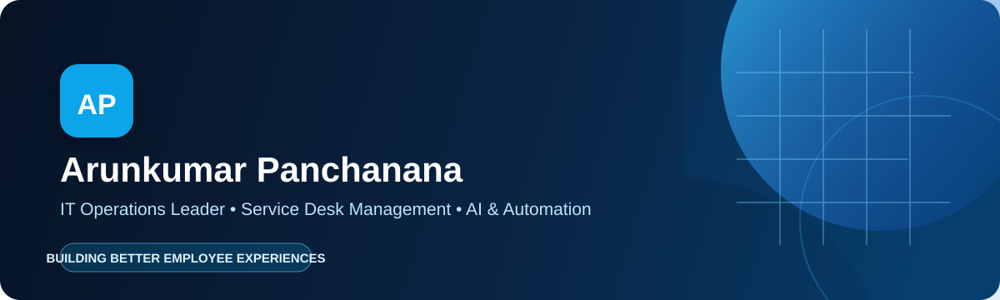

<!--
  A GitHub-safe HTML profile README for Arunkumar Panchanana.
  Replace YOUR_GITHUB_USERNAME and YOUR_LINKEDIN_USERNAME before publishing.
  Upload the assets/ folder alongside this file, then save this content as README.md
  in a repository named exactly YOUR_GITHUB_USERNAME.
-->

  

  
  
  

  
  
  

<table>
  <tr>
    <td width="50%" valign="top">
      <h2>👋 About me</h2>
      
I lead global IT support organizations that make the employee technology experience feel simple, reliable, and human.

      
My work sits at the intersection of <strong>service management</strong>, <strong>modern workplace technology</strong>, and <strong>AI-powered operations</strong>.

    </td>
    <td width="50%" valign="top">
      <h2>🎯 My operating principle</h2>
      <blockquote>
        Great support is not just resolving tickets. It is removing friction before people feel it.
      </blockquote>
      
<strong>Based in:</strong> Bengaluru, India 
      <strong>Open to:</strong> IT operations, service management, and workplace technology conversations.

    </td>
  </tr>
</table>

<h2>Core strengths</h2>

<table>
  <tr>
    <td width="33%" valign="top" align="center">⚡ <strong>Operational excellence</strong> ITSM, incident management, performance reporting, and service improvement</td>
    <td width="33%" valign="top" align="center">🤖 <strong>AI with purpose</strong> Automation, virtual agents, knowledge assistants, and self-service</td>
    <td width="33%" valign="top" align="center">🌐 <strong>People at scale</strong> Global support leadership, mentoring, and stakeholder alignment</td>
  </tr>
</table>

<h2>My technology landscape</h2>

<h3>Service delivery, automation &amp; AI</h3>

  
  
  
  
  
  

<h3>Cloud, identity &amp; endpoint</h3>

  
  
  
  
  
  
  

  
<strong>More tools I work with</strong>

   
  Amazon Connect · Zoom Contact Center · Active Directory · Microsoft Entra ID (Azure AD) · Intune · Jamf / Casper · PingID · Nexthink · Druva inSync · Hyper-V · Exchange Online · VPN · MFA · MDM · KCS

<h2>Impact in practice</h2>

<table>
  <tr>
    <td valign="top" width="50%">
      <strong>📊 Make operations visible</strong> 
      Built APAC performance dashboards in ServiceNow and Amazon Connect, turning support activity into timely operational insight.
    </td>
    <td valign="top" width="50%">
      <strong>✨ Improve the support journey</strong> 
      Partnered on AI-enabled service improvements across SLA adherence, CSAT, first-contact resolution, and handling time.
    </td>
  </tr>
  <tr>
    <td valign="top" width="50%">
      <strong>🧭 Lead through complexity</strong> 
      Directed enterprise site operations, support teams, and asset lifecycle practices across major technology campuses.
    </td>
    <td valign="top" width="50%">
      <strong>📚 Prevent repeat issues</strong> 
      Strengthened proactive support, root-cause analysis, knowledge practices, and self-service to reduce avoidable demand.
    </td>
  </tr>
</table>

<h2>Credentials that shape my work</h2>

  
  
  
  
  

  <strong>Let's build support experiences people can trust.</strong>  
  <a href="https://www.linkedin.com/in/YOUR_LINKEDIN_USERNAME/">LinkedIn</a> &nbsp;•&nbsp; <a href="mailto:arunkumar.panchanana@gmail.com">Email</a> &nbsp;•&nbsp; <a href="https://github.com/YOUR_GITHUB_USERNAME">GitHub</a>

